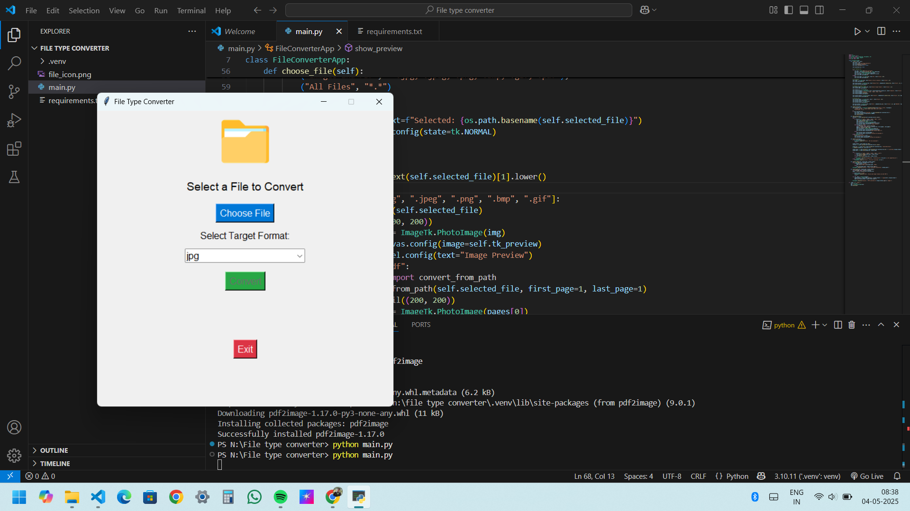

# 🗂️ File Type Converter - With Live Preview & Multi-Format Support

A lightweight and easy-to-use **File Converter App** built with Python and Tkinter.  
Supports converting between **JPG, JPEG, PNG, and PDF** formats — with a built-in **file preview** before conversion!  
Also handles missing icons gracefully, so it never crashes. 🔥

---

## ✨ Features
- ✅ Convert between **JPG, JPEG, PNG, PDF** formats
- ✅ Dropdown to select target conversion type
- ✅ Live Preview of selected image or PDF (first page)
- ✅ Auto-handles missing icon files (never crashes)
- ✅ Simple, user-friendly **Tkinter UI**
- ✅ Output saved in a **Converted_Files** folder

---

## 🖥️ Demo (Screenshots)
### 📸 Screenshot 1


### 📸 Screenshot 2


### 📸 Screenshot 3


### 📸 Screenshot 4


---

## 🚀 Requirements
- Python 3.x
- Install dependencies:
  ```bash
  pip install pillow fpdf2 pdf2image
📦 Supported Conversions
From	To Options
JPG, JPEG	PNG, PDF
PNG	JPG, PDF
PDF	JPG, PNG

🙌 Credits
Built with 💙 using Python, Tkinter, and Pillow

PDF preview powered by pdf2image

📄 License
This project is open source and available under the MIT License.
